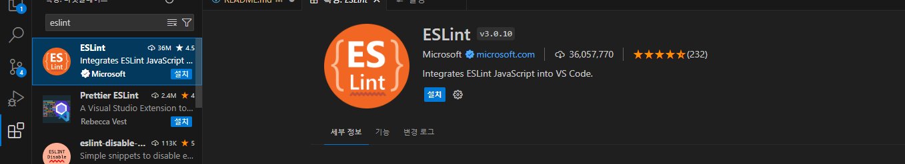
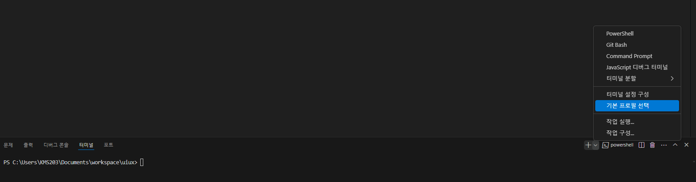

# VS Code 설치

- 검색창에 `vsCode` 를 입력하여 `visual Code Studio` 를 찾아 다운로드 및 설치하기

## vsCode 실행하기

- 작업폴더에서 마우스 우클릭하여 vsCode 실행하기

## vsCode 플러그인 설치하기

- 검색 창에 `Korea` 입력 : `Korea Lan. Pack` 설치
  

- 검색 창에 `prettier` 입력 : `Prettier - Code formatter` 설치
  

- 검색 창에 `ESLint` 입력 : `ESLint` 설치
  

- 검색 창에 `Icon` 입력 : `Material Icon Theme` 설치
  

- 검색 창에 `Live` 입력 : `Live Server` 설치
  

## vsCode 세팅하기

- `Ctrl + Shift + `` 터미널 -> 기본프로필 선택 -> Git bash
  
  

- `Ctrl + ,` 를 눌러 세팅실행하기
- Editor, Font Family : D2Coding 으로 변경하기

- 설정에서 formatter 검색하여 `Prettier - Code formatter`로 Default formatter 변경
  

- save 검색하여 `format on Save` 체크하기
  
